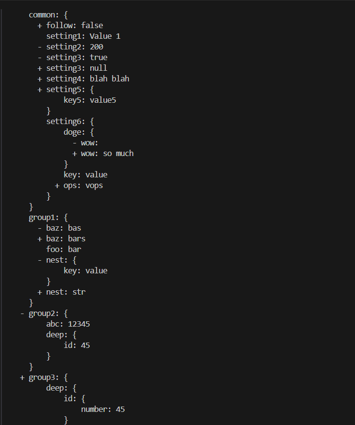
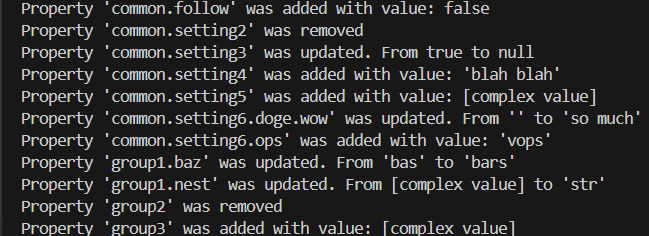
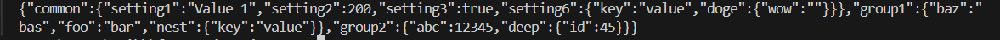

### Hexlet tests and linter status:

<a href="reports/mutation/mutation.html">stryker report</a>

<h1>Overview:</h1>

<code>gendiff < filename1 > < filename2 > --format[output type]</code>

outputs differences between two yaml(yml)/json files in a specified format.

<h1>Output Formats:</h1>

<h3>Stylish</h3>

Default output format.

'+' for added elements.
'-' for deleted elements.

<h3>Plain</h3>

Plain format.

[complex value] for objects.

<h3>JSON</h3>

JSON object notation.

